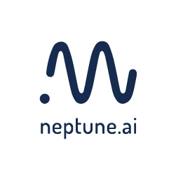
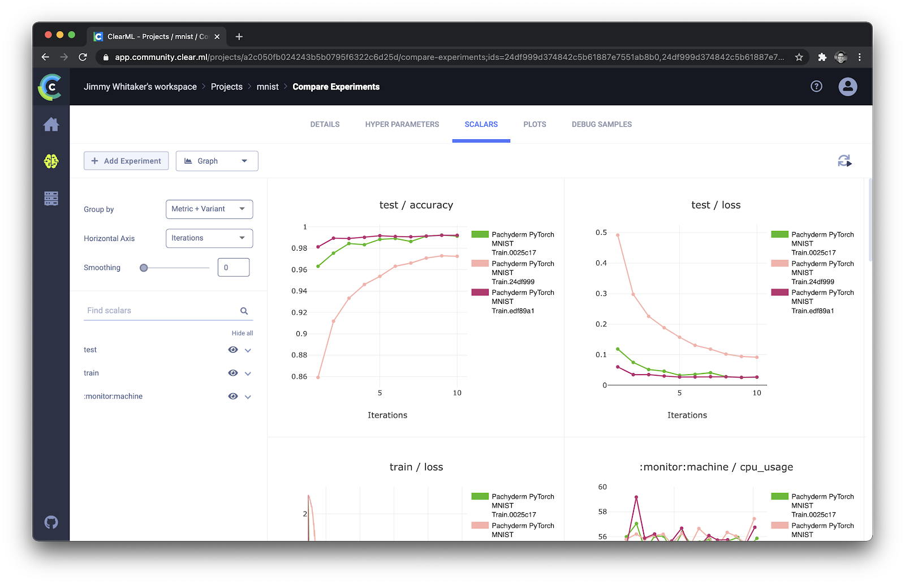

# **Experiment Tracking Benchmark**

This is a package to test the performance of different experiment tracking tools: `Tensorboard`, `Weights and Biases`, `Neptune`, `Comet` and `ClearML`.

<p align="center">
  
</p>

**Table of Contents**
- [**Experiment Tracking Benchmark**](#experiment-tracking-benchmark)
  - [**Usage**](#usage)
  - [**Comparison**](#comparison)
    - [**Tensorboard**](#tensorboard)
    - [**Weights and Biases**](#weights-and-biases)
    - [Neptune](#neptune)
    - [Comet](#comet)
    - [ClearML](#clearml)

## **Usage**

Make sure you have Python installed:

**1. Install the package with pip in your terminal:**

```
pip install git+https://github.com/AlexandreSajus/Experiment-Tracking-Benchmark.git
```

**2. Run the benchmark with the following command:**

```
python -m trackbench NAME_OF_EXPERIMENT
```

Currently the supported experiments are: `tensorboard`, `wandb`

This will train DQN and PPO on CartPole and output the experiment tracking website in the terminal.

For example, for tensorboard, the output will be:

```
Hello world from trackbench (Trackbench is a tool for evaluating the performance of experiment tracking tools.)
Training DQN on CartPole...
Total reward: 157.0

Training PPO on CartPole...
Total reward: 500.0

Launching TensorBoard
TensorBoard launched at http://localhost:6006/
Press Ctrl+C to stop TensorBoard
```

You will then be able to access the experiment tracking website at http://localhost:6006/ which will show result curves:

## **Comparison**

### **Tensorboard**

<p align="left">
  
</p>

Tensorboard creates a local webpage with curves of the training process. It is supported on many platforms and is really easy to start with but it is not very customizable.

<p align="center">
  
</p>

:white_check_mark: Advantages:
- Very easy to use
- Supported on many platforms
- Free

:x: Disadvantages:
- Difficult to customize
- Limited
- Basic interface

### **Weights and Biases**

<p align="left">
  
</p>


Weights and Biases records a lot of data about the training process and creates a webpage to visualize it

This allows the creation of customizable dashboards to visualize and analyze the training process.

<p align="center">
  
</p>

But also hosted webpages with reports that you can share with colleagues

<p align="center">
  
</p>

:white_check_mark: Advantages:
- Many features (dashboards, reports, video, audio, ...), very customizable
- Very ergonomic interface
- Supported everywhere with easy to follow documentation

:x: Disadvantages:
- Setup is more complicated, takes time to learn
- Paid when working as a team
- Requires an account and an internet connection

### Neptune

<p align="left">
  
</p>

Neptune is very similar to Weights and Biases, it records a lot of data about the training process and creates a webpage to visualize it.

<p align="center">
  
</p>

:white_check_mark: Advantages:
- Many features (dashboards, reports, video, audio, ...)
- Very customizable, even more than Weights and Biases
- Most ML platforms supported with documentation

:x: Disadvantages:
- Some ML platforms are not supported (e.g sb3) and documentation is very dense
- Paid when working as a team
- Requires an account and an internet connection

### Comet

<p align="left">
  
</p>

Comet does the same thing as Weights and Biases and Neptune but it has less features and is less ergonomic

<p align="center">
  
</p>

:white_check_mark: Advantages:
- Most ML platforms supported with documentation

:x: Disadvantages:
- Does not have as many features as Weights and Biases and Neptune (e.g video support)
- Some ML platforms are not supported (e.g sb3) and documentation is very dense
- Paid when working as a team

### ClearML

<p align="left">
  
</p>

ClearML is also a web based experiment tracking tool but it is more oriented towards ML for production

<p align="center">
  
</p>

:white_check_mark: Advantages:
- Better suited for ML for production
- Most ML platforms supported with documentation

:x: Disadvantages:
- Not very suited for RL (no video support, no stable baselines support)
- Very hard to use