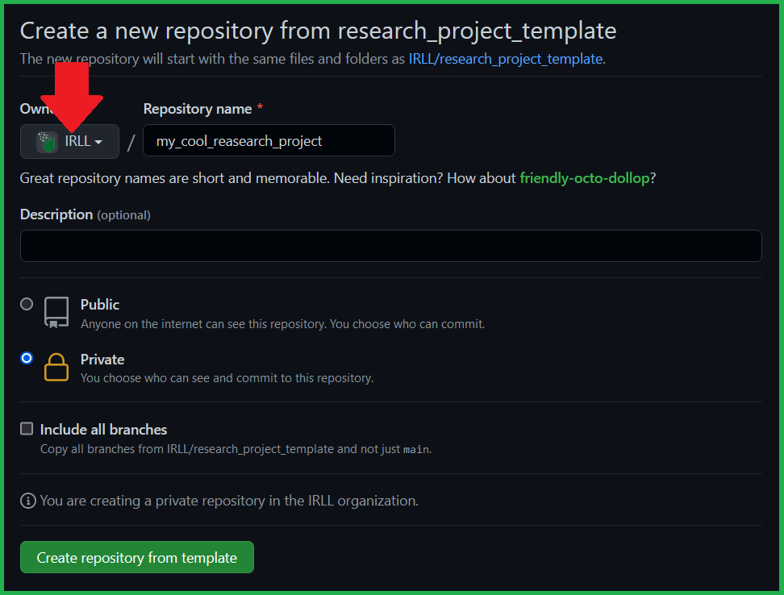
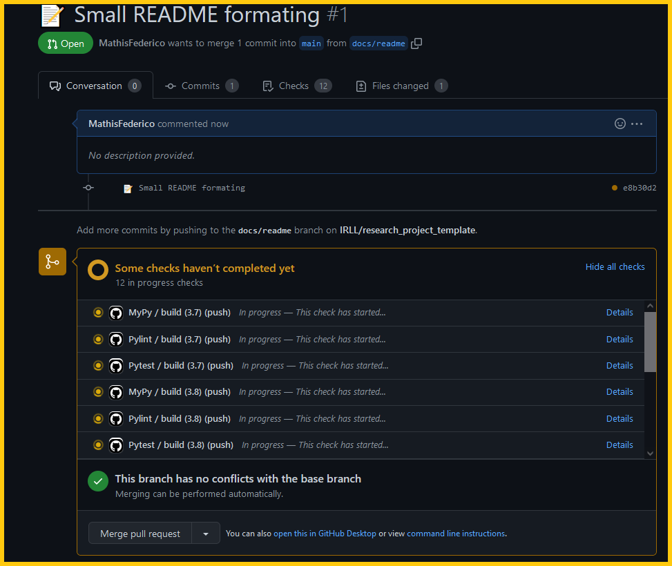
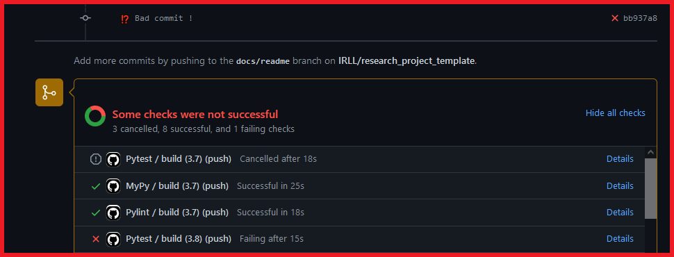
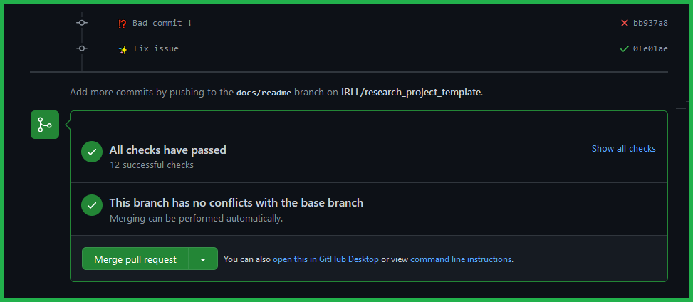

# Research project template

A GitHub template for research projects in the awesome IRL lab !

# Usage

Clic on the `Use this template` button to create a repository following this template.


Make sure that you create it in the IRLL GitHub organisation so others will be able to find it
and potentialy collaborate.



# Structure of the template

| Folder     | Use                                                               |
| ---------- | ----------------------------------------------------------------- |
| `.github`  | Files relative to GitHub behavior (GitHub actions workflows, ...) |
| `assets`   | Store images or other assets use for presentation                 |
| `commands` | A list of useful shell commands                                   |
| `src`      | Source code                                                       |
| `tests`    | Tests that ensure that the source code behave as expected         |

| File                   | Use                                                                    |
| ---------------------- | ---------------------------------------------------------------------- |
| `.gitignore`           | Specify which files or folders should NOT be versioned                 |
| `LICENSE`              | License to allow others to use your code, default is Apache 2.0        |
| `pyproject.toml`       | Configuration file for the project (pip, pytests, pylint, mypy, ...)   |
| `requirements-dev.txt` | Python dependencies for developers of this codebase                    |
| `requirements.txt`     | Python dependencies for any user of this codebase                      |
| `setup.py`             | File that allow `pip install` to work properly (uses `pyproject.toml`) |

# Installation

## For others

This template allows your code to be packaged from the start !
Anyone (with access) can directly pip install it using:

```bash
> pip install git+https://github.com/IRLL/<repository_name>.git 
```

As such, dependencies in `requirements.txt` would be installed, try to keep them up to date !
(The continuous integration of tests will fail anyway if you don't ... more on that later !)

## Development

To get started and build reproductible research, here is a few things to do
before you can start to code.

### Clone

First clone your newly built repository.

```bash
> git clone https://github.com/IRLL/<repository_name>.git
```

### Choose a package name

It should be short, descriptive of your research and start with `irll_`.
(Example: `irll_coolpkg`)

Then replace `mypackage` by your package name (make use of `Ctrl+H` and `Ctrl+Maj+H` shortcuts):

-   In `src`
-   In `pyproject.toml`

### Virtual environment (optional but recommended)

It is advised to setup a virtual environment.

```bash
> python -m venv venv
```

And then to activate it

<details>
<summary>Windows</summary>
<br>
<pre>
venv\Scripts\activate
</pre>

</details>

<details>
<summary>Linux/MacOS</summary>
<br>
<pre>
source venv/bin/activate
</pre>
</details>

### Install your future code as an editable package

When developing, one can have import issues using different python files,
if you pip install your own code as an editable package, you won't ever have an import issue !

```bash
> pip install -e .
```

You can check your installation with the entrypoint provided that matches your package name:

```bash
> mypackage
Hello world from mypackage (A description of mypackage)
```

This runs code in the `main` function in `src/mypackage/__main__.py`,
that you can of course customize as you wish.

### Install developer requirements

As a developer, you must also install the developer requirements.

```bash
> pip install -r requirements-dev.txt
```

# Developer guide

With everything installed, you could start to code in `src/mypackage` !

But before that, let's make a tour of the tools we made available to you !

## Commands

In developer requirements, you installed cool tools:

-   pytest
-   pytest-cov
-   pylint
-   mypy
-   isort
-   black

They all have commands on how to use them set up in `commands`.

You can use commands depending on your operating system like this:

```bash
> commands\<win or unix>\<command_name>
```

Of course you are free to look in the files and to learn what they do !

## GitHub Actions & Branch protection

The `main` branch of this repository is protected, it means that you cannot directly
push on it.

What you must to instead :

1.  **Create a branch** for the SMALLEST objective possible you have in mind

2.  **Open a pull request (PR)** from your new branch to `main`

This Pull request will allow GitHub to run "actions" when you push new commits.
Those "actions" are located in `.github/workflows` and will run tests, check types, lint code, ...
This allows you to ensure that your code quality is nice **as you are coding**.



3.  **Code** on this branch until this SMALLEST objective possible is achieved, 
    keeping an eye on GitHub actions.

4.  If you work as a team, **ask for a review** of you pull request, so your teammate(s) 
    can give you feedbacks and be up to date on you work.

5.  Try to merge on `main`, but maybe the GitHub actions won't allow you if some tests fails or your quality is too low !



6.  Fix the issues pointed out by the GitHub actions, then finaly **merge** on `main`.



**Why go through the trouble ?** 

It may seems like you are loosing time on the short term, but if you don't keep your code clean, 
debugging will takes more and more time and each new idea or feature will be harder to implement.

Until it's not even possible to add anything to the project.
Then you will start to feel like any modification could break everything,
and thus you don't code on the project anymore.
And if you don't code on the project, you will have not idea how your code even runs anymore.
The less documentation you have, the worst this becomes.

Your work will then be **unusable by anyone** meaning lost and forgotten.

So keep it mind that those small effort in the short term will payoff nicely after a few months on
a software project.
